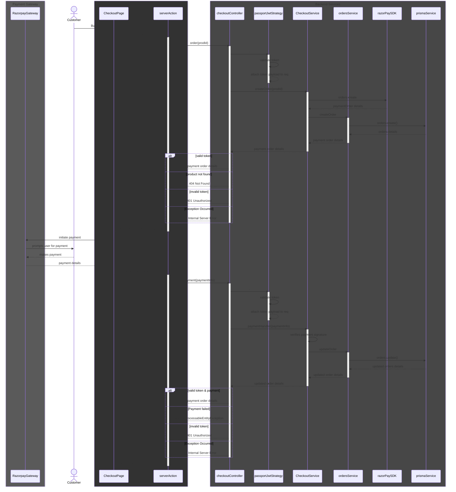

```mermaid
sequenceDiagram

    %%{init: {'theme': 'base', 'themeVariables': { 
        'primaryColor': '#000000',  // Darker background for boxes
        'edgeColor': '#3e3e3e',      // White edges for better visibility
        'nodeTextColor': '#3e3e3e',  // White text for better contrast
        'signalColor': '#00ff00',    // Bright green signals
        'background': '#1a1a1a'       // Dark background for the entire diagram
    }}}%%

    box rgb(90, 90, 90) Payment Gateway
        participant RazorpayGateway
    end

    actor Customer

    box rgb(50, 50, 50) Frontend Application
        participant CheckoutPage
        participant serverAction
    end
    
    box rgb(71, 71, 71) Backend Services
        participant checkoutController
        participant passportJwtStrategy
        participant CheckoutService
        participant ordersService
        participant razorPaySDK
        participant prismaService
    end
    
    Customer->>CheckoutPage: Buy

    CheckoutPage->>serverAction: createOrder(prodId)
    activate serverAction

    serverAction->>checkoutController: order(prodId)
    activate checkoutController
    checkoutController->> passportJwtStrategy:.
    activate passportJwtStrategy
    passportJwtStrategy->>passportJwtStrategy: validate token
    passportJwtStrategy-->>passportJwtStrategy: attach token payload to req
    deactivate passportJwtStrategy

    checkoutController->>CheckoutService: createOrder(prodId)
    activate CheckoutService
    CheckoutService->>razorPaySDK: orders.create
    razorPaySDK-->>CheckoutService: paymentOrder details
    CheckoutService->>ordersService: createOrder
    activate ordersService
    ordersService->> prismaService: orders.create()
    prismaService-->>ordersService: orders details
    ordersService-->>CheckoutService: payment order details
    deactivate ordersService
    CheckoutService-->>checkoutController: payment order details
    deactivate CheckoutService

    alt valid token
        checkoutController-->>serverAction: 201 payment order details
    else product not found
        checkoutController-->>serverAction: 404 Not Found
    else invalid token
        checkoutController-->>serverAction: 401 Unauthorized
    else Exception Occurred
        checkoutController-->>serverAction: 500 Internal Server Error
    end
    deactivate checkoutController

    serverAction-->>CheckoutPage: response (payment order details)
    deactivate serverAction

    CheckoutPage->>RazorpayGateway: initiate payment
    activate RazorpayGateway
    RazorpayGateway->>Customer: prompts user for payment
    Customer-->>RazorpayGateway: makes payment
    RazorpayGateway-->>CheckoutPage: payment details


    CheckoutPage->>serverAction: verifyOrder(paymentInfo)
    activate serverAction

    serverAction->>checkoutController: payment(paymentInfo)
    activate checkoutController
    checkoutController->> passportJwtStrategy:.
    activate passportJwtStrategy
    passportJwtStrategy->>passportJwtStrategy: validate token
    passportJwtStrategy-->>passportJwtStrategy: attach token payload to req
    deactivate passportJwtStrategy

    checkoutController->>CheckoutService: paymentHandler(paymentInfo)
    activate CheckoutService
    CheckoutService->>CheckoutService: verifies payment signature
    CheckoutService->>ordersService: updateOrder
    activate ordersService
    ordersService->> prismaService: orders.update()
    prismaService-->>ordersService: updated orders details
    ordersService-->>CheckoutService: updated order details
    deactivate ordersService
    CheckoutService-->>checkoutController: updated order details
    deactivate CheckoutService

    alt valid token & payment
        checkoutController-->>serverAction: 201 payment order details
    else Payment failed
        checkoutController-->>serverAction: 404 UnprocessableEntityException
    else invalid token
        checkoutController-->>serverAction: 401 Unauthorized
    else Exception Occurred
        checkoutController-->>serverAction: 500 Internal Server Error
    end
    deactivate checkoutController

    serverAction-->>CheckoutPage: response (updated order details)
    deactivate serverAction

```
