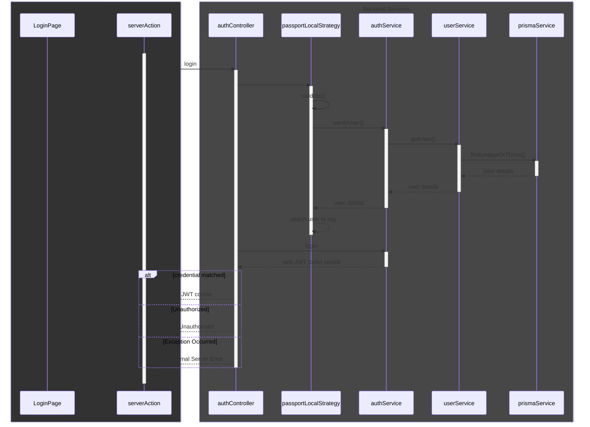

```mermaid
sequenceDiagram

    %%{init: {'theme': 'base', 'themeVariables': { 
        'primaryColor': '#000000',  // Darker background for boxes
        'edgeColor': '#3e3e3e',      // White edges for better visibility
        'nodeTextColor': '#3e3e3e',  // White text for better contrast
        'signalColor': '#00ff00',    // Bright green signals
        'background': '#1a1a1a'       // Dark background for the entire diagram
    }}}%%
    
    box rgb(50, 50, 50) Frontend Application
        participant LoginPage
        participant serverAction
    end
    
    box rgb(71, 71, 71) Backend Services
        participant authController
        participant passportLocalStrategy
        participant authService
        participant userService
        participant prismaService
    end
    
    LoginPage->>serverAction: create-user()
    activate serverAction

    serverAction->>authController: login
    activate authController
    authController->> passportLocalStrategy:.
    activate passportLocalStrategy
    passportLocalStrategy->>passportLocalStrategy: validate()
    passportLocalStrategy->> authService: verifyUser()
    activate authService
    authService->>userService: getUser()
    activate userService
    userService->>prismaService: findUniqueOrThrow()
    activate prismaService

    prismaService-->>userService: user details
    deactivate prismaService
    userService-->>authService: user details
    deactivate userService
    authService-->>passportLocalStrategy: user details
    deactivate authService
    passportLocalStrategy-->>passportLocalStrategy: attach user to req
    deactivate passportLocalStrategy

    authController->>authService: login
    activate authService
    authService-->>authController: sets JWT toekn cookie
    deactivate authService

    alt credential matched
        authController-->>serverAction: 201 JWT cookie
    else Unauthorized
        authController-->>serverAction: 401 Unauthorized
    else Exception Occurred
        authController-->>serverAction: 500 Internal Server Error
    end
    deactivate authController

    serverAction-->>LoginPage: response (status, JWT Cookie)
    deactivate serverAction
```
