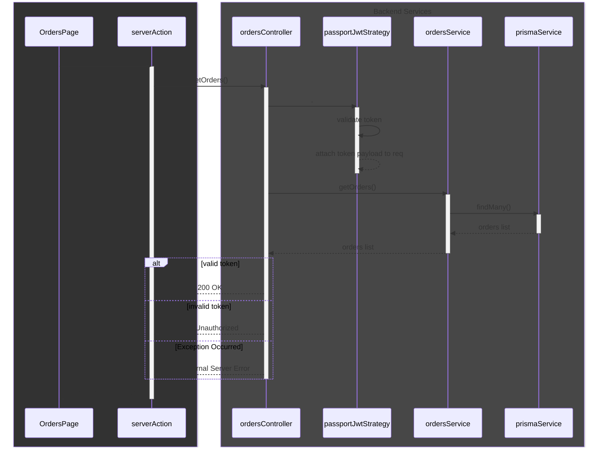

```mermaid
sequenceDiagram

    %%{init: {'theme': 'base', 'themeVariables': { 
        'primaryColor': '#000000',  // Darker background for boxes
        'edgeColor': '#3e3e3e',      // White edges for better visibility
        'nodeTextColor': '#3e3e3e',  // White text for better contrast
        'signalColor': '#00ff00',    // Bright green signals
        'background': '#1a1a1a'       // Dark background for the entire diagram
    }}}%%
    
    box rgb(50, 50, 50) Frontend Application
        participant OrdersPage
        participant serverAction
    end
    
    box rgb(71, 71, 71) Backend Services
        participant ordersController
        participant passportJwtStrategy
        participant ordersService
        participant prismaService
    end
    
    OrdersPage->>serverAction: getOrders()
    activate serverAction

    serverAction->>ordersController: getOrders()
    activate ordersController
    ordersController->> passportJwtStrategy:.
    activate passportJwtStrategy
    passportJwtStrategy->>passportJwtStrategy: validate token
    passportJwtStrategy-->>passportJwtStrategy: attach token payload to req
    deactivate passportJwtStrategy

    ordersController->>ordersService: getOrders()
    activate ordersService
    ordersService->>prismaService: findMany()
    activate prismaService
    prismaService-->>ordersService: orders list
    deactivate prismaService
    ordersService-->>ordersController: orders list
    deactivate ordersService

    alt valid token
        ordersController-->>serverAction: 200 OK
    else invalid token
        ordersController-->>serverAction: 401 Unauthorized
    else Exception Occurred
        ordersController-->>serverAction: 500 Internal Server Error
    end
    deactivate ordersController

    serverAction-->>OrdersPage: response (orders list)
    deactivate serverAction
```
