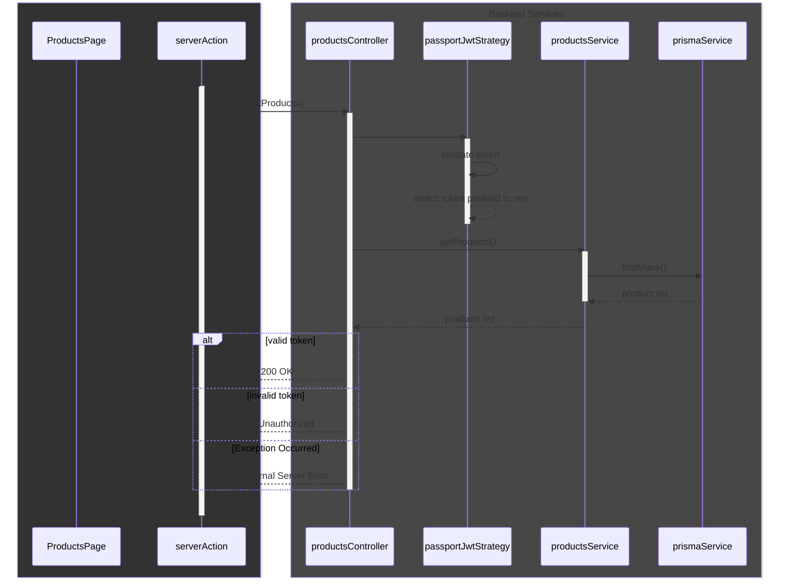

```mermaid
sequenceDiagram

    %%{init: {'theme': 'base', 'themeVariables': { 
        'primaryColor': '#000000',  // Darker background for boxes
        'edgeColor': '#3e3e3e',      // White edges for better visibility
        'nodeTextColor': '#3e3e3e',  // White text for better contrast
        'signalColor': '#00ff00',    // Bright green signals
        'background': '#1a1a1a'       // Dark background for the entire diagram
    }}}%%
    
    box rgb(50, 50, 50) Frontend Application
        participant ProductsPage
        participant serverAction
    end
    
    box rgb(71, 71, 71) Backend Services
        participant productsController
        participant passportJwtStrategy
        participant productsService
        participant prismaService
    end
    
    ProductsPage->>serverAction: getProducts()
    activate serverAction

    serverAction->>productsController: getProducts()
    activate productsController
    productsController->> passportJwtStrategy:.
    activate passportJwtStrategy
    passportJwtStrategy->>passportJwtStrategy: validate token
    passportJwtStrategy-->>passportJwtStrategy: attach token payload to req
    deactivate passportJwtStrategy

    productsController->>productsService: getProducts()
    activate productsService
    productsService->>prismaService: findMany()
    activate prismaService
    prismaService-->>productsService: product list
    deactivate productsService
    productsService-->>productsController: products list

    alt valid token
        productsController-->>serverAction: 200 OK
    else invalid token
        productsController-->>serverAction: 401 Unauthorized
    else Exception Occurred
        productsController-->>serverAction: 500 Internal Server Error
    end
    deactivate productsController

    serverAction-->>ProductsPage: response (product list)
    deactivate serverAction
```
