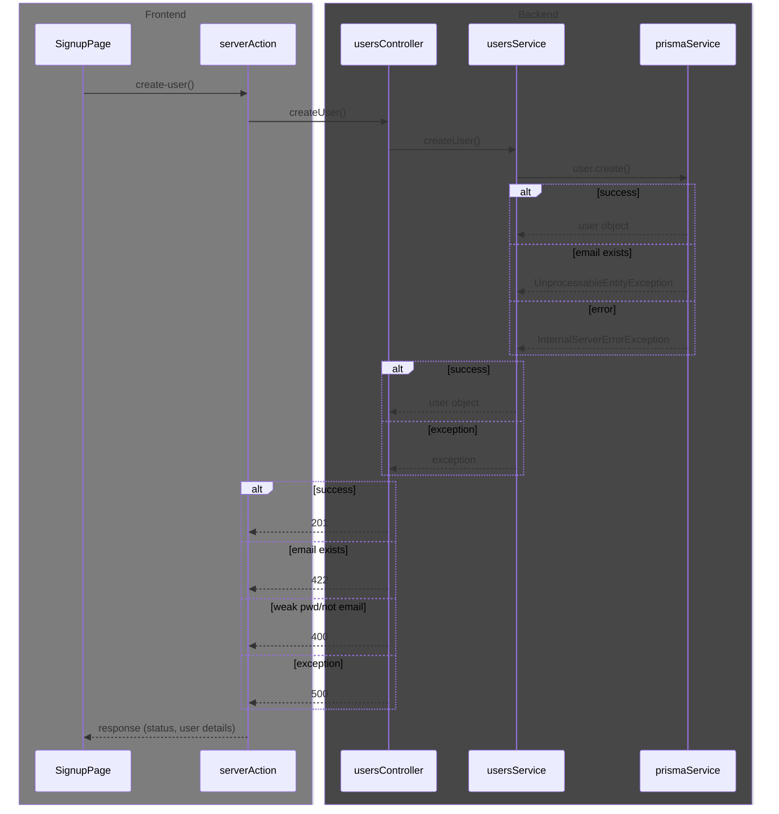

```mermaid
sequenceDiagram
    box rgb(125, 125, 125) Frontend
    participant SignupPage
    participant serverAction
    end
    box rgb(71, 71, 71) Backend
    participant usersController
    participant usersService
    participant prismaService
    end
    SignupPage->>serverAction: create-user()
    serverAction->>usersController: createUser()
    usersController->>usersService: createUser()
    usersService->>prismaService: user.create()
    alt success 
    prismaService-->>usersService: user object
    else email exists
    prismaService-->>usersService: UnprocessableEntityException
    else error
    prismaService-->>usersService: InternalServerErrorException
    end  
    alt success 
    usersService-->>usersController: user object
    else exception
    usersService-->>usersController: exception
    end    
    alt success 
    usersController-->>serverAction: 201
    else email exists
    usersController-->>serverAction: 422
    else weak pwd/not email
    usersController-->>serverAction: 400
    else exception
    usersController-->>serverAction: 500
    end
    serverAction-->>SignupPage: response (status, user details)
```
