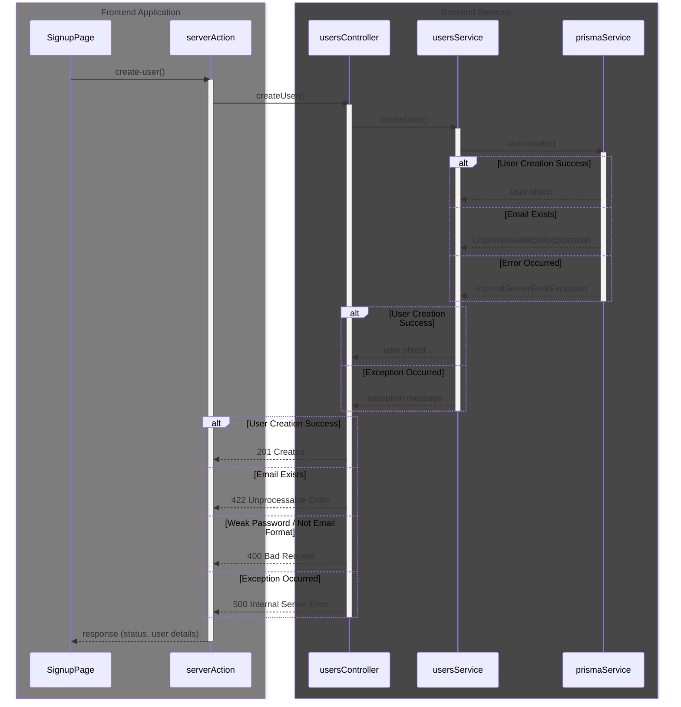

```mermaid
sequenceDiagram

    %%{init: {'theme': 'base', 'themeVariables': { 
        'primaryColor': '#000000',  // Darker background for boxes
        'edgeColor': '#3e3e3e',      // White edges for better visibility
        'nodeTextColor': '#3e3e3e',  // White text for better contrast
        'signalColor': '#00ff00',    // Bright green signals
        'background': '#1a1a1a'       // Dark background for the entire diagram
    }}}%%
    
    box rgb(125, 125, 125) Frontend Application
        participant SignupPage
        participant serverAction
    end
    
    box rgb(71, 71, 71) Backend Services
        participant usersController
        participant usersService
        participant prismaService
    end
    
    SignupPage->>serverAction: create-user()
    activate serverAction
    
    serverAction->>usersController: createUser()
    activate usersController
    
    usersController->>usersService: createUser()
    activate usersService
    
    usersService->>prismaService: user.create()
    activate prismaService
    
    alt User Creation Success
        prismaService-->>usersService: user object
    else Email Exists
        prismaService-->>usersService: UnprocessableEntityException
    else Error Occurred
        prismaService-->>usersService: InternalServerErrorException
    end
    
    deactivate prismaService
    
    alt User Creation Success
        usersService-->>usersController: user object
    else Exception Occurred
        usersService-->>usersController: exception message
    end
    
    deactivate usersService
    
    alt User Creation Success
        usersController-->>serverAction: 201 Created
    else Email Exists
        usersController-->>serverAction: 422 Unprocessable Entity
    else Weak Password / Not Email Format
        usersController-->>serverAction: 400 Bad Request
    else Exception Occurred
        usersController-->>serverAction: 500 Internal Server Error
    end
    
    deactivate usersController
    
    serverAction-->>SignupPage: response (status, user details)
    deactivate serverAction
```
